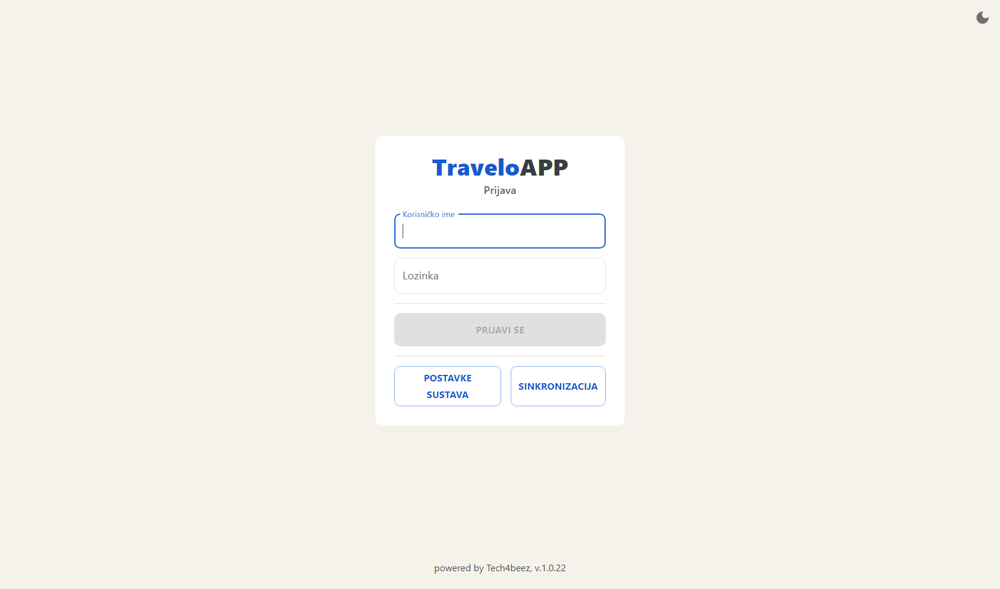
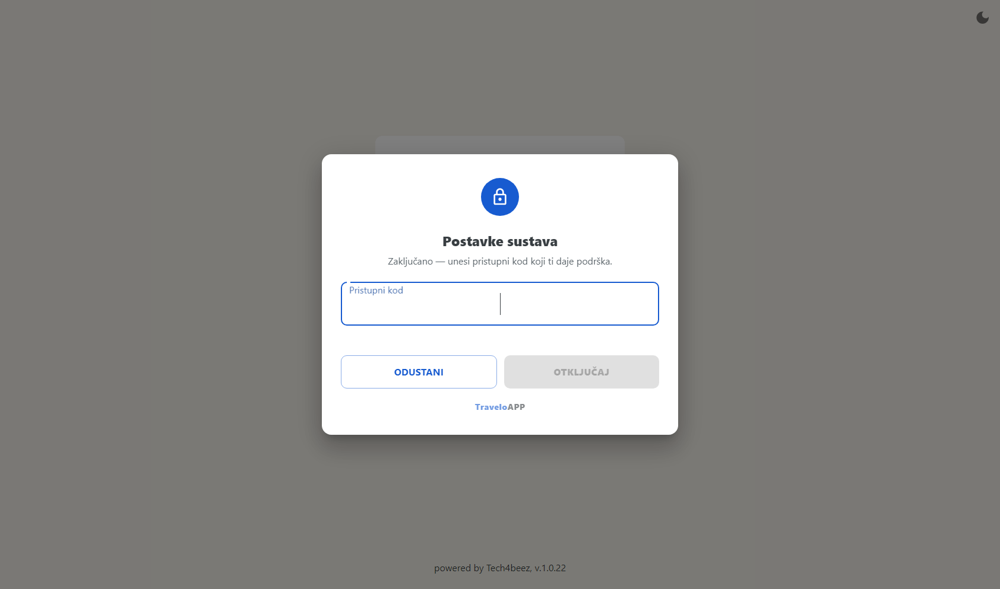

# TraveloAPP Boat Desk

## Upute za blagajnika

Prodaja karata na blagajni. Sve što treba za jednu smjenu, redom kojim se radi.

**VERZIJA 1.0.23 · IZDANJE 30.08.2026.**

---

## Tijek smjene

Koraci 1–6 idu ovim redom jer jedan ovisi o drugom: bez otvorene smjene nema prodaje. Blagajna je već uparena i postavljena — to je posao ureda, ne blagajnika.

### 1. Prijava operatera

Prijavljuješ se korisničkim imenom i lozinkom, istima koje koristiš i u portalu.

Pri dnu ekrana piše verzija aplikacije. Reci je uredu kad prijavljuješ problem.

Gumb **SINKRONIZACIJA** povlači operatere, cjenik i plovidbeni red s poslužitelja. Koristi ga kad ti je ured javio promjenu — novog operatera, novu cijenu ili izmijenjen plovidbeni red. Pričekaj da poruka o preuzimanju nestane; tek tada su svi podaci na blagajni.

Gumb **POSTAVKE SUSTAVA** otvara postavke instalacije i zaključan je pristupnim kodom. To nije dio dnevnog rada — vidi poglavlje *Postavke sustava* na kraju.

### 2. Otvaranje smjene

U donjoj traci pritisni **SMJENE** pa **OTVORI SMJENU**. Uz smjenu možeš dopisati napomenu.

Bez otvorene smjene ne može se izdati račun. Svaki operater ima svoju smjenu: ako je preuzimaš od kolege, on zaključuje svoju, a ti se prijaviš i otvoriš novu.

Smjena koja ostane otvorena preko noći **zatvara se sama u 01:00**. Tada te aplikacija odjavi i javi „Smjena je automatski zatvorena u 01:00." Ujutro se prijaviš i otvoriš novu.

### 3. Odabir polaska

U traci iznad radne plohe biraš, slijeva nadesno:

| Polje | Što bira |
| --- | --- |
| **Datum putovanja** | dan za koji prodaješ; gumb **DANAS** vraća na današnji datum |
| **Odaberi liniju** | linija koju blagajna smije prodavati |
| **Odaberi luku** | luka ukrcaja |
| **Odaberi polazak i smjer** | konkretan polazak (smjer A ili B) |

Gumb **OSVJEŽI FORMU** briše odabir i vraća praznu formu — najbrži način da počneš iznova bez odjave.

Ne vidiš neku liniju? Svaki naplatni uređaj ima popis linija koje smije prodavati, a postavlja ga ured u portalu. Ako linije nema ni nakon sinkronizacije, javi uredu.

### 4. Prodaja karata

Radna ploha ima četiri stupca i radi se slijeva nadesno:

| Stupac | Što radiš |
| --- | --- |
| **Odredišta** | odabir odredišta i broj putnika, kaveza i bicikala |
| **Karte** | odabir vrste karte i cijene; gumb **DODAJ ODABRANO** stavlja ih u košaricu |
| **Košarica** | pregled po vrsti karte — količina, cijena, iznos; **UKLONI** briše redak |
| **Plaćanje** | odabir sredstva plaćanja |

Kad je košarica složena i sredstvo plaćanja odabrano, izdaješ račun iz donje trake.

Uz račun možeš uključiti:

- **R1 račun** — kad kupac traži račun na tvrtku. Otvara podatke kupca, a gumb adresara nudi ranije upisane kupce.
- **F2 — e-račun** — kad taj R1 treba ići i kao e-račun. **F2 račun se ne ispisuje** jer se kupcu dostavlja elektronički; karte se ispisuju zasebno.
- **POVLAŠTENE KARTICE** — za otočne i druge povlaštene karte, prije nego dodaš karte u košaricu.

Račun i karte ispisuju se odmah po izdavanju.

### 5. Računi i karte tijekom smjene

U donjoj traci su dva popisa:

- **RAČUNI** — svi računi ove blagajne. Otvaranjem računa dobiješ detalje, ispis kopije i storno.
- **KARTE** — pojedinačne karte, s ispisom kopije i stornom jedne karte.

Kopija se ispisuje s oznakom **KOPIJA** preko dokumenta, da se ne zamijeni s izvornikom.

### 6. Zaključak smjene

Pritisni **SMJENE** pa otvori pregled smjene. **Pregled smjene** pokazuje:

- početak i završetak, broj računa i raspon brojeva,
- promet po sredstvu plaćanja,
- PDV osnovicu, PDV, lučku pristojbu i ukupno,
- zasebno **Storno** i **Storno s drugih prodajnih mjesta**, ako ih je bilo.

Provjeri iznose prije nego zaključiš. Zaključak se ispisuje sam, a kopiju možeš dobiti kasnije: otvori smjenu u popisu i pritisni **Ispiši kopiju zaključka**.

---

## Kad zatreba

### Storno računa

Otvori račun u popisu **RAČUNI** i pritisni **Storniraj račun**. Odabereš **postotak povrata** i sredstvo kojim vraćaš novac, pa provedeš storno. Storno račun se ispisuje odmah.

Postotke povrata postavlja ured u portalu (*Administracija → Postotci storniranja*). Ako ih nema, blagajna to javi i storno se ne može provesti dok ne stignu.

Što se **ne može** stornirati: storno račun, već stornirani račun i karta koja je već stornirana.

### Storno karte s drugog prodajnog mjesta

Kad putnik donese kartu kupljenu drugdje — na webu, kod partnera ili na drugoj blagajni — koristi **Storno karte po oznaci**: upišeš oznaku karte, pritisneš **TRAŽI**, odabereš sredstvo povrata i **STORNIRAJ**.

Takav storno ulazi u zaključak smjene zasebno, pod *Storno s drugih prodajnih mjesta*, jer prodaja nije bila tvoja.

### Funkcijske tipke

Izbornik operatera (ikona osobe gore desno) → **Funkcijske tipke**. Tipkama F1–F12 dodjeljuješ radnje koje najčešće koristiš:

- Izdaj račun, Osvježi formu, R1 račun (adresar), Povlaštene kartice,
- Pregled računa, Pregled karata, Smjene,
- ili odabir pojedinog sredstva plaćanja.

Dodijeljena tipka piše na samom gumbu, npr. *KARTICA (F2)*. Postavka je vezana uz operatera, pa svaki može imati svoju.

### Obavijesti s poslužitelja

Kad ured otkaže polazak ili ga pomakne, blagajna to dozna sama i prikaže obavijest koju zatvaraš s **×**. Popis polazaka se osvježi bez tvog zahvata — nema potrebe za odjavom ni ponovnom sinkronizacijom.

---

## Rad bez interneta

Blagajna radi i bez mreže. Cjenik, plovidbeni red i operateri stoje na računalu, a račun se uvijek izda i spremi lokalno. Slanje na poslužitelj je zaseban posao koji aplikacija obavlja sama čim mreža bude dostupna.

Ikona mreže u zaglavlju pokazuje ima li veze. Ikona za sinkronizaciju uz nju povlači svježe podatke; dok se vrti, dohvat traje.

Ako želiš poslati zaostale dokumente odmah, u postavkama sustava postoji **POŠALJI NEPOSLANE DOKUMENTE**.

---

## Postavke sustava

Otvaraju se s ekrana prijave, gumbom **POSTAVKE SUSTAVA**, i zaključane su pristupnim kodom koji daje podrška. Nisu dio dnevnog rada — mijenja ih se pri postavljanju blagajne ili kad se zamijeni oprema.

| Postavka | Čemu služi |
| --- | --- |
| Adresa backend sustava | poslužitelj na koji se blagajna spaja |
| Printer za ispis računa / karata | mogu biti isti ili dva različita printera |
| Širina ispisa | širina papira u printeru |
| Rez papira na printeru | reže li printer papir nakon ispisa |
| Čitač kartica + **Prepoznaj spojene čitače** | čitač otočnih iskaznica; gumb sam ponudi ono što je spojeno |
| EFTPOS port | port kartičnog terminala |
| Automatska validacija karata | karta se pri prodaji odmah označi kao validirana — za blagajne na samom ukrcaju |
| Ispis platnog slipa na blagajni | ispisuje li se slip kartične transakcije |
| Ispis dodatnog slipa | drugi primjerak slipa |
| Numeracija računa | sljedeći fiskalni i sljedeći redni broj računa |
| POŠALJI NEPOSLANE DOKUMENTE | gura zaostale račune na poslužitelj |
| UKLONI UPARIVANJE | odvezuje blagajnu s naplatnog uređaja; nakon toga se traži novo uparivanje (TID i OTP) |

Numeraciju računa dirati samo po uputi ureda — brojevi računa moraju teći bez prekida.

---

## Ako nešto ne radi

| Što vidiš | Što napraviti |
| --- | --- |
| Nema linija ili polazaka za odabrani dan | Pritisni ikonu sinkronizacije u zaglavlju. Ako i dalje nema, provjeri je li plovidbeni red za taj dan unesen i je li linija omogućena tvojoj blagajni. |
| Nema cijene za odabranu relaciju | Za taj par luka nije unesen cjenik. Javi uredu; karta se ne može prodati dok cjenik ne stigne. |
| „Sinkronizacija nije prošla… Zadržani su zadnji spremljeni podaci." | Blagajna nije došla do poslužitelja. Provjeri mrežu. Radi se sa zadnjim spremljenim podacima, prodaja se ne zaustavlja. |
| Novi operater se ne može prijaviti | Na ekranu prijave pritisni **SINKRONIZACIJA** — operateri se povlače s poslužitelja. |
| Izmjena iz portala nije stigla | Sinkronizacija u zaglavlju povlači cjenik i plovidbeni red usred smjene, bez odjave. |
| Račun se ne ispisuje | Provjeri printer i papir, pa u postavkama sustava provjeri je li odabran ispravan printer. Kopiju možeš ispisati iz popisa **RAČUNI**. |
| „Račun je već storniran" | Taj je račun već poništen; u popisu potraži pripadajući storno dokument. |
| Kartično plaćanje ne prolazi | Terminal javlja razlog. Ništa nije izdano — pokušaj ponovno ili naplati drugim sredstvom. |
| Smjena je automatski zatvorena | Smjena je prešla 01:00 i sustav ju je zaključio. Prijavi se i otvori novu. |

Kad prijavljuješ problem uredu, reci **verziju aplikacije** — piše na dnu ekrana za prijavu.

---

Upute vrijede za TraveloAPP Boat Desk, verzija 1.0.23. Izgled pojedinih ekrana ovisi o postavkama blagajne u portalu — dopuštena sredstva plaćanja, linije i prava operatera postavlja ured.
