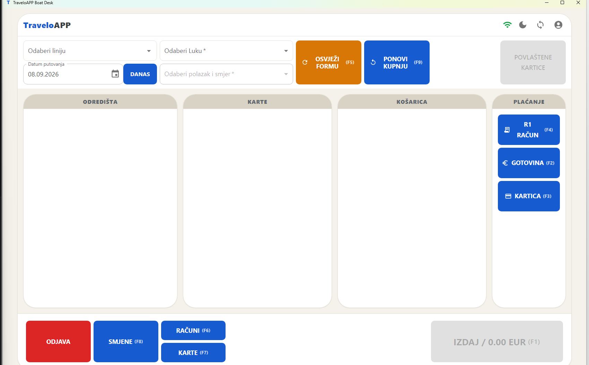
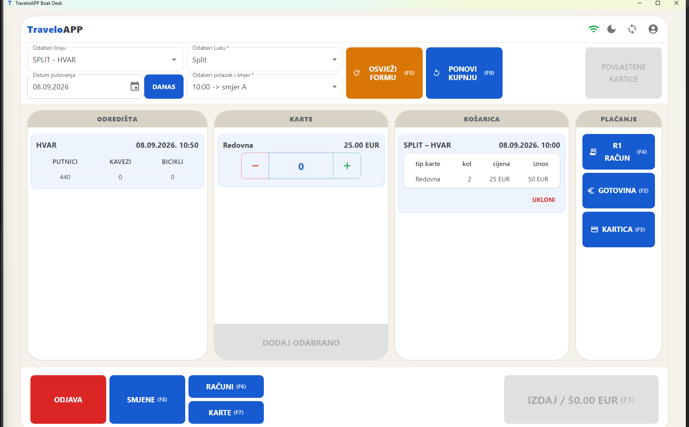
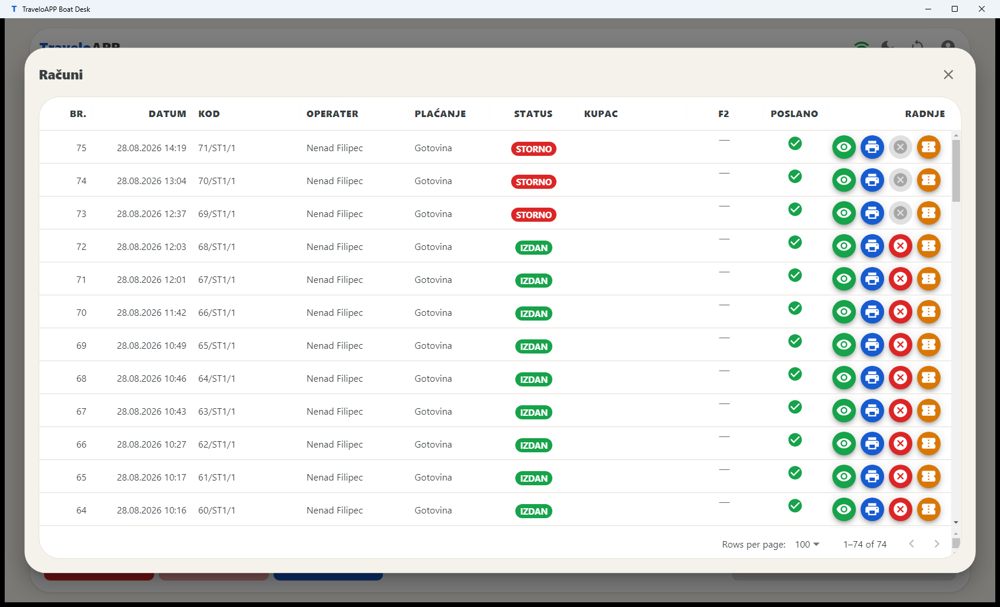
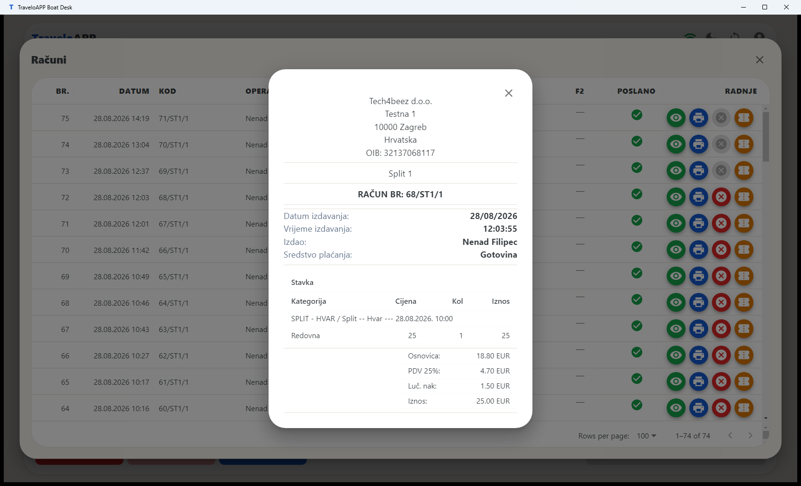
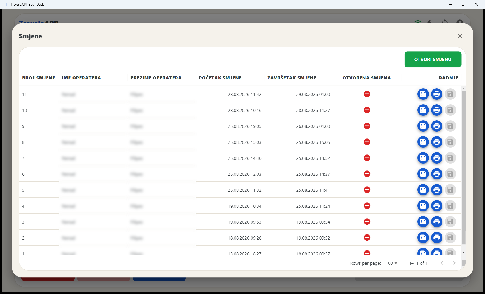
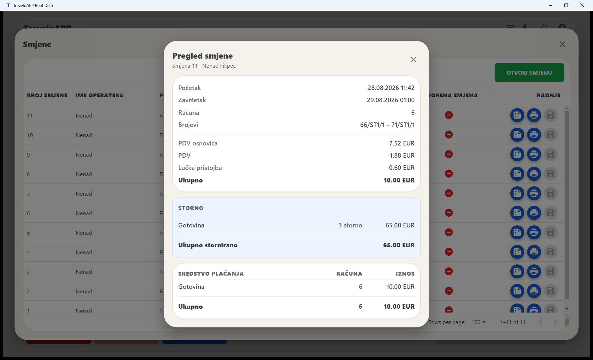
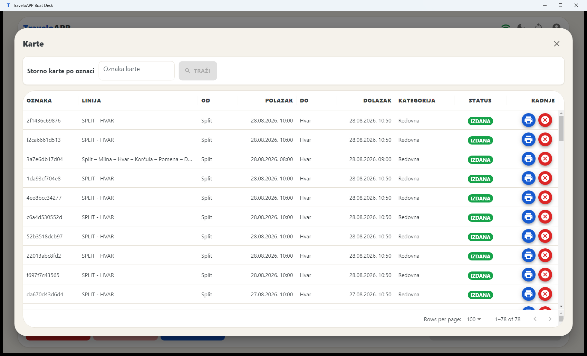
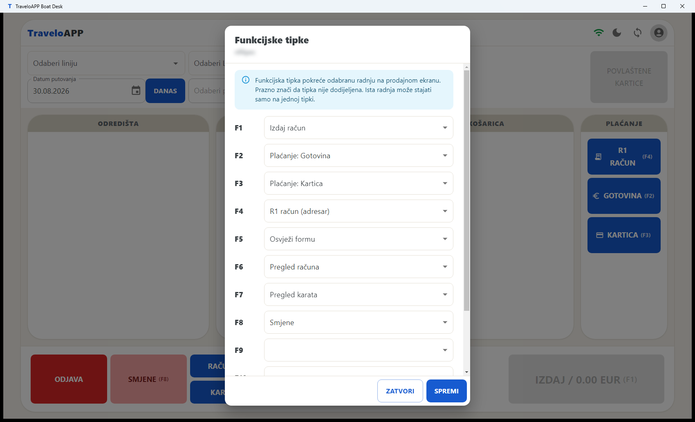

# TraveloAPP Boat Desk

## Upute za blagajnika

Prodaja karata na blagajni. Sve što treba za jednu smjenu, redom kojim se radi.

**VERZIJA 1.0.24 · IZDANJE 08.09.2026.**

---

## Tijek smjene

Koraci 1–6 idu ovim redom jer jedan ovisi o drugom: bez otvorene smjene nema prodaje. Blagajna je već uparena i postavljena — to je posao podrške, ne blagajnika.

### 1. Prijava operatera

Prijavljujete se korisničkim imenom i lozinkom, istima koje koristite i u portalu.

Pri dnu ekrana piše verzija aplikacije. Recite je podršci kad prijavljujete problem.

Gumb **SINKRONIZACIJA** povlači operatere, cjenik i plovidbeni red s poslužitelja. Koristite ga kad vam je podrška javila promjenu — novog operatera, novu cijenu ili izmijenjen plovidbeni red. Pričekajte da poruka o preuzimanju nestane; tek tada su svi podaci na blagajni.

Gumb **POSTAVKE SUSTAVA** otvara postavke instalacije i zaključan je pristupnim kodom. Njih postavlja podrška — nisu dio dnevnog rada.

### 2. Otvaranje smjene

U donjoj traci pritisnite **SMJENE** pa **OTVORI SMJENU**. Uz smjenu možete dopisati napomenu.

Bez otvorene smjene ne može se izdati račun. Svaki operater ima svoju smjenu: ako je preuzimate od kolege, on zaključuje svoju, a vi se prijavite i otvorite novu.

Smjena koja ostane otvorena preko noći **zatvara se sama u 01:00**. Tada vas aplikacija odjavi i javi „Smjena je automatski zatvorena u 01:00." Ujutro se prijavite i otvorite novu.

### 3. Odabir polaska

U traci iznad radne plohe birate, slijeva nadesno:

| Polje | Što bira |
| --- | --- |
| **Datum putovanja** | dan za koji prodajete; gumb **DANAS** vraća na današnji datum |
| **Odaberi liniju** | linija koju blagajna smije prodavati |
| **Odaberi luku** | luka ukrcaja |
| **Odaberi polazak i smjer** | konkretan polazak (smjer A ili B) |

Gumb **OSVJEŽI FORMU** briše odabir i vraća praznu formu — najbrži način da počnete iznova bez odjave.

Gumb **PONOVI KUPNJU** pored njega vraća košaricu zadnjeg izdanog računa — isti polasci, iste vrste karata i količine — pa ostaje samo izdati račun. Polazak koji je u međuvremenu prošao ne ulazi u košaricu i o tome dobijete poruku.

U izborniku operatera (ikona osobe gore desno) → **Osobne postavke** birate **matičnu luku**: kad odaberete liniju, luka ukrcaja i prvi sljedeći polazak iz nje postave se sami. Uz to stoji i prekidač **automatski odaberi prvu luku dolaska**, koji popunjava i odredište.

Ne vidite neku liniju? Svaki naplatni uređaj ima popis linija koje smije prodavati, a postavlja ga podrška u portalu. Ako linije nema ni nakon sinkronizacije, javite podršci.

### 4. Prodaja karata

Radna ploha ima četiri stupca i radi se slijeva nadesno:

| Stupac | Što radite |
| --- | --- |
| **Odredišta** | odabir odredišta i uvid u raspoložive kapacitete — putnici, kavezi, bicikli |
| **Karte** | odabir vrste karte i količine; gumb **DODAJ ODABRANO** stavlja ih u košaricu |
| **Košarica** | pregled po polasku i vrsti karata — količina, cijena, iznos; **UKLONI** briše redak |
| **Plaćanje** | odabir sredstva plaćanja |

Kad je košarica složena i sredstvo plaćanja odabrano, račun izdajete iz donje trake.

Uz račun možete uključiti:

- **R1 račun** — kad kupac traži račun na tvrtku. Otvara podatke kupca, a gumb adresara nudi ranije upisane kupce.
- **F2 — e-račun** — kad taj R1 treba ići i kao e-račun. **F2 račun se ne ispisuje** jer se kupcu dostavlja elektronički; karte se ispisuju zasebno.
- **POVLAŠTENE KARTICE** — za otočne i druge povlaštene karte, prije nego karte dodate u košaricu.

Račun i karte ispisuju se odmah po izdavanju.

### 5. Računi i karte tijekom smjene

U donjoj traci su dva popisa:

- **RAČUNI** — svi računi ove blagajne. Otvaranjem računa dobivate detalje, ispis kopije i storno.
- **KARTE** — pojedinačne karte, s ispisom kopije i stornom jedne karte.

Zelena ikona otvara račun i pokazuje ga onako kako je ispisan.

Kopija se ispisuje s oznakom **KOPIJA** preko dokumenta, da se ne zamijeni s izvornikom.

Kopija karte uz to nosi i **tri dodatna znaka na kraju broja karte**, koji se ispisuju i u QR kodu. Po njima kontrola razlikuje kopiju od izvorne karte i vidi koja je po redu. Blagajna ih računa sama, pa kopija izlazi i kad interneta nema; ispis se zabilježi i pošalje poslužitelju kad veza proradi.

Ako je na naplatnom uređaju postavljen logotip, ispisuje se u vrhu računa odnosno karte. Postavlja ga podrška u portalu, zasebno za račun i za kartu.

### 6. Zaključak smjene

Pritisnite **SMJENE** pa otvorite pregled smjene. **Pregled smjene** pokazuje:

- početak i završetak, broj računa i raspon brojeva,
- promet po sredstvu plaćanja,
- PDV osnovicu, PDV, lučku pristojbu i ukupno,
- zasebno **Storno** i **Storno s drugih prodajnih mjesta**, ako ih je bilo.

Prije zaključenja možete upisati **napomenu** — istu onakvu kakva se upisuje pri otvaranju smjene (npr. manjak, višak, kvar na pisaču). Ostaje zapisana uz smjenu.

Provjerite iznose prije nego zaključite. Zaključak se ispisuje sam, a kopiju možete dobiti kasnije: otvorite smjenu u popisu i pritisnite **Ispiši kopiju zaključka**.

---

## Kad zatreba

### Storno računa

Otvorite račun u popisu **RAČUNI** i pritisnite **Storniraj račun**. Odaberete **postotak povrata** i sredstvo kojim vraćate novac, pa provedete storno. Storno račun se ispisuje odmah.

Postotke povrata postavlja podrška u portalu (*Administracija → Postotci storniranja*). Ako ih nema, blagajna to javi i storno se ne može provesti dok ne stignu.

Što se **ne može** stornirati: storno račun, već stornirani račun i karta koja je već stornirana.

### Storno karte s drugog prodajnog mjesta

Kad putnik donese kartu kupljenu drugdje — na webu, kod partnera ili na drugoj blagajni — koristite **Storno karte po oznaci**: upišete oznaku karte, pritisnete **TRAŽI**, odaberete sredstvo povrata i **STORNIRAJ**.

Takav storno ulazi u zaključak smjene zasebno, pod *Storno s drugih prodajnih mjesta*, jer prodaja nije bila vaša.

### Funkcijske tipke

Izbornik operatera (ikona osobe gore desno) → **Funkcijske tipke**. Tipkama F1–F12 dodjeljujete radnje koje najčešće koristite:

- Izdaj račun, Osvježi formu, Ponovi kupnju, R1 račun (adresar), Povlaštene kartice,
- Pregled računa, Pregled karata, Smjene,
- ili odabir pojedinog sredstva plaćanja.

Dodijeljena tipka piše na samom gumbu, npr. *KARTICA (F2)*. Postavka je vezana uz operatera, pa svaki može imati svoju.

### Obavijesti s poslužitelja

Kad se polazak otkaže ili pomakne, blagajna to dozna sama i prikaže obavijest koju zatvarate s **×**. Popis polazaka se osvježi bez vašeg zahvata — nema potrebe za odjavom ni ponovnom sinkronizacijom.

---

## Rad bez interneta

Blagajna radi i bez mreže. Cjenik, plovidbeni red i operateri stoje na računalu, a račun se uvijek izda i spremi lokalno. Slanje na poslužitelj je zaseban posao koji aplikacija obavlja sama čim mreža bude dostupna.

Ikona mreže u zaglavlju pokazuje ima li veze. Ikona za sinkronizaciju uz nju povlači svježe podatke; dok se vrti, dohvat traje.

Ako zaostali dokumenti ne odu ni nakon što se mreža vrati, javite podršci — ona ih može gurnuti ručno.

---

## Ako nešto ne radi

| Što vidite | Što napraviti |
| --- | --- |
| Nema linija ili polazaka za odabrani dan | Pritisnite ikonu sinkronizacije u zaglavlju. Ako i dalje nema, provjerite je li plovidbeni red za taj dan unesen i je li linija omogućena vašoj blagajni. |
| Nema cijene za odabranu relaciju | Za taj par luka nije unesen cjenik. Javite podršci; karta se ne može prodati dok cjenik ne stigne. |
| „Sinkronizacija nije prošla… Zadržani su zadnji spremljeni podaci." | Blagajna nije došla do poslužitelja. Provjerite mrežu. Radi se sa zadnjim spremljenim podacima, prodaja se ne zaustavlja. |
| Novi operater se ne može prijaviti | Na ekranu prijave pritisnite **SINKRONIZACIJA** — operateri se povlače s poslužitelja. |
| Izmjena iz portala nije stigla | Sinkronizacija u zaglavlju povlači cjenik i plovidbeni red usred smjene, bez odjave. |
| Račun se ne ispisuje | Provjerite printer i papir. Kopiju možete ispisati iz popisa **RAČUNI**; ako ni ona ne izađe, javite podršci. |
| „Račun je već storniran" | Taj je račun već poništen; u popisu potražite pripadajući storno dokument. |
| Kartično plaćanje ne prolazi | Terminal javlja razlog. Ništa nije izdano — pokušajte ponovno ili naplatite drugim sredstvom. |
| Smjena je automatski zatvorena | Smjena je prešla 01:00 i sustav ju je zaključio. Prijavite se i otvorite novu. |

Kad prijavljujete problem podršci, recite **verziju aplikacije** — piše na dnu ekrana za prijavu.

---

Upute vrijede za TraveloAPP Boat Desk, verzija 1.0.24. Izgled pojedinih ekrana ovisi o postavkama blagajne u portalu — dopuštena sredstva plaćanja, linije i prava operatera postavlja podrška.
