# TraveloAPP Boat Mobile

## Upute za operatera

Prodaja i validacija karata na ručnom terminalu. Sve što treba za jednu smjenu, redom kojim se radi.

**VERZIJA 1.0.6 · IZDANJE 08.09.2026.**

---

## Tijek smjene

Koraci 1–6 idu ovim redom jer jedan ovisi o drugom: bez otvorene smjene nema ni prodaje ni validacije. Uređaj je već uparen i postavljen — to je posao ureda, ne blagajne.

### 1. Prijava operatera

Prijavljuješ se korisničkim imenom i lozinkom, istima koje koristiš i u portalu.

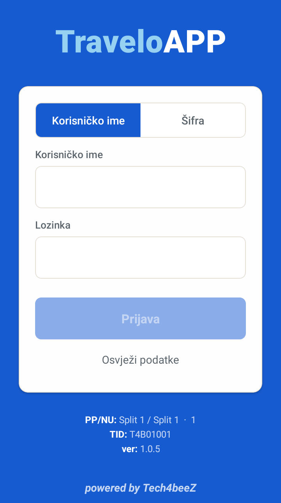

Pri dnu ekrana pišu poslovni prostor, naplatni uređaj, TID i verzija aplikacije. Provjeri ih ako nisi siguran radiš li na pravom uređaju.

Gumb **Osvježi podatke** povlači operatere, cjenik i plovidbeni red s poslužitelja. Koristi ga kad ti je ured javio promjenu — novog operatera, novu cijenu ili izmijenjen plovidbeni red. Pričekaj da natpis *Osvježavanje…* nestane; tek tada su svi podaci na uređaju.

### 2. Otvaranje smjene

Na glavnom izborniku odaberi **Zaključci smjena** pa **Otvori smjenu**. Uz smjenu možeš dopisati napomenu.

Bez otvorene smjene nema ni prodaje ni validacije. Ako pokušaš ući u **Plovidba**, uređaj javlja „Smjena nije otvorena" i nudi da je otvoriš odmah.

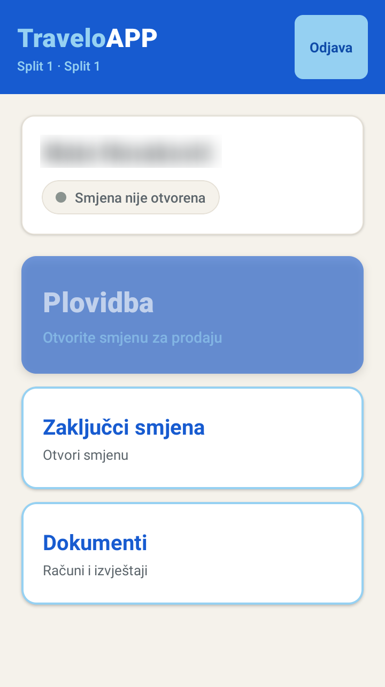

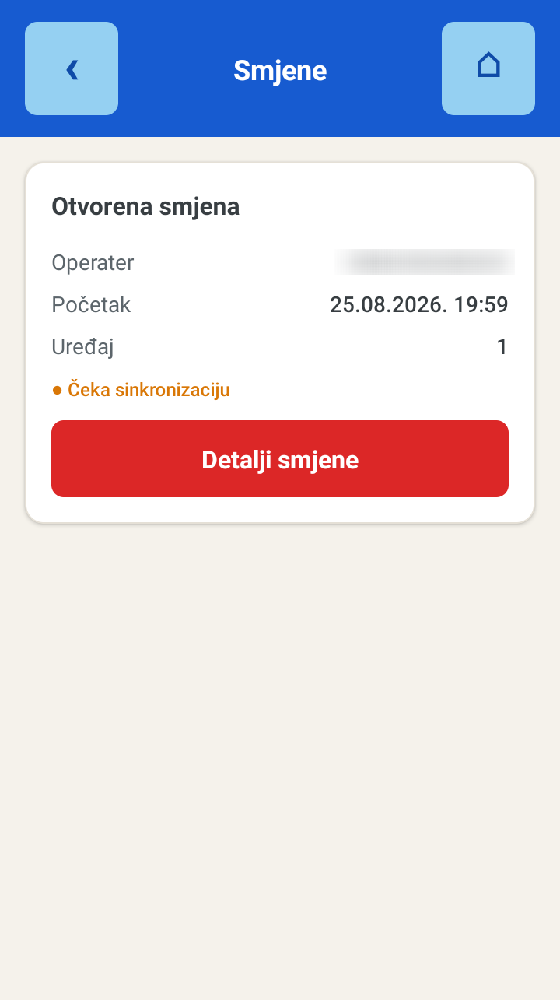

Točkica **Čeka sinkronizaciju** znači da podatak još nije otišao na poslužitelj — uređaj ga šalje sam čim uhvati mrežu.

Svaki operater ima svoju smjenu. Ako smjenu preuzimaš od kolege, on zaključuje svoju, a ti se prijaviš i otvoriš novu.

### 3. Odabir linije i polaska

Iz glavnog izbornika idi na **Plovidba**. Prvo biraš liniju, zatim polazak. Nude se samo današnje linije i polasci.

Popis se osvježava povlačenjem prsta prema dolje. To je najbrži način da dohvatiš izmjenu plovidbenog reda bez odjave.

Polazak se s popisa miče **dva sata nakon dolaska u zadnju luku**, pa pri kraju smjene ostaju samo polasci koji još voze.

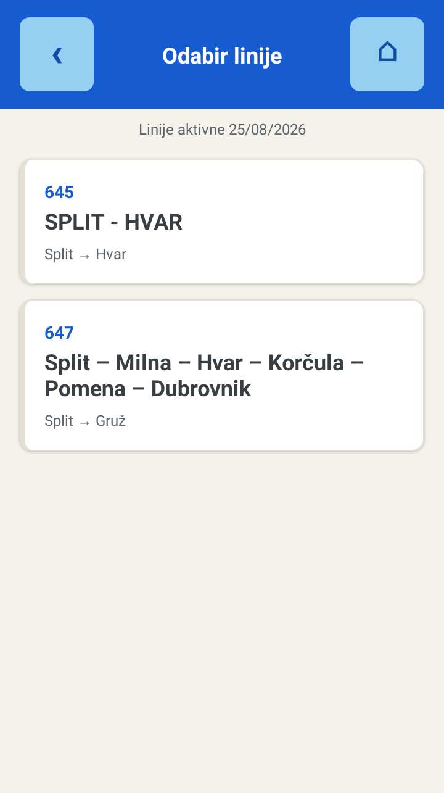

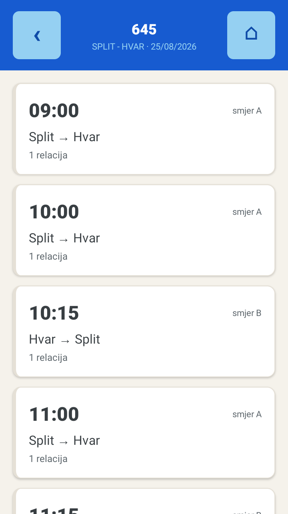

Ne vidiš neku liniju? Svaki terminal ima popis linija koje smije prodavati, a postavlja ga ured u portalu. Ako linije nema ni nakon osvježavanja, javi uredu — vjerojatno nije omogućena za taj uređaj.

### 4. Prodaja karata

Na kartici **Prodaja** odaberi **OD LUKE** i **DO LUKE** strelicama, pa pod **TIPOVI KARATA** tipkama **+** i **−** dodaj karte. Iznos se zbraja u **UKUPNO**.

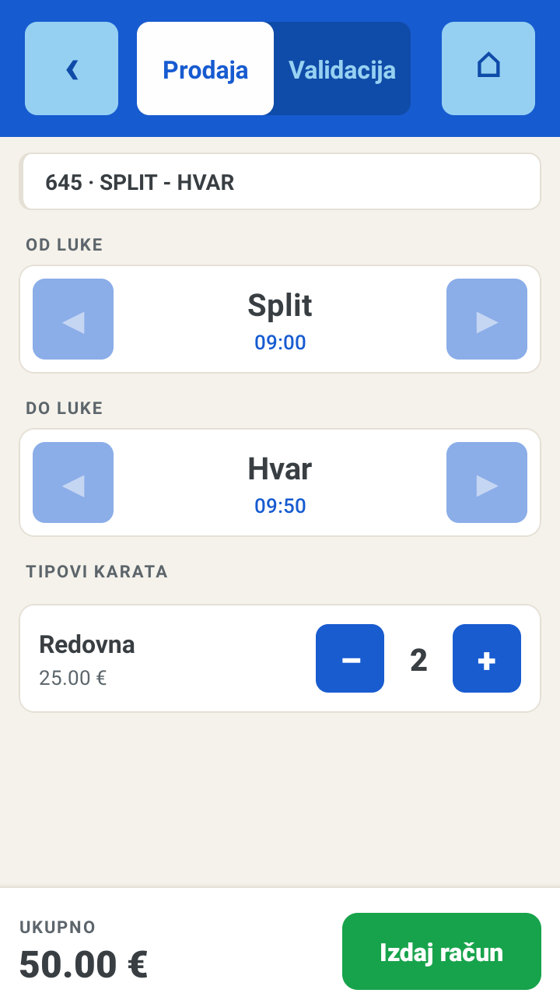

Pritisni **Izdaj račun** i u prozoru koji se otvori odaberi:

- **Način plaćanja** — gotovina, kartica ili drugo sredstvo koje je uređaju dopušteno.
- **R1 račun** — kad kupac traži račun na tvrtku.
- **F2 fiskalizacija** — kad taj R1 treba ići i kao e-račun.

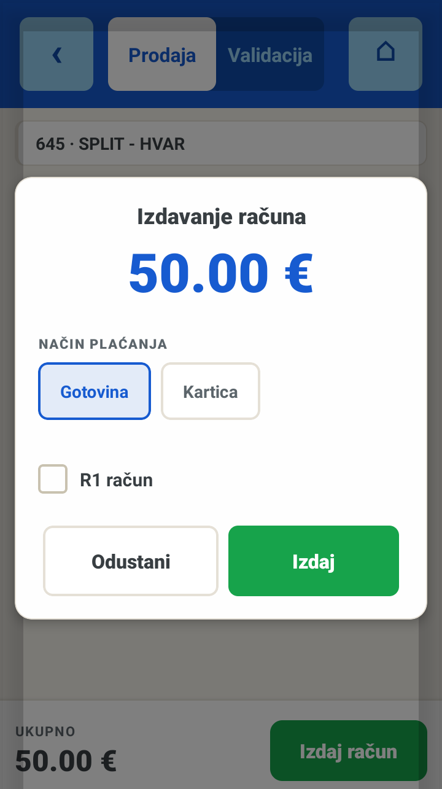

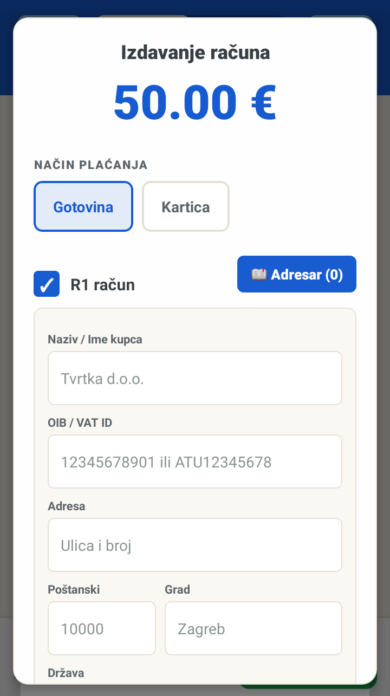

Potvrdi s **Izdaj**. Račun i karte se ispisuju odmah. Dok traje ispis na ekranu stoji **ISPIS U TIJEKU** — ne vadi papir i ne pritišći ništa dok ne nestane.

### 5. Validacija karata

Karte se skeniraju bez prebacivanja ekrana. Tipka za skeniranje sa strane uređaja radi i dok si na kartici **Prodaja**, a rezultat se prikaže preko cijelog zaslona.

Kartica **Validacija** treba samo za promjenu **ULAZNE LUKE**, brojač validiranih, gumb **Osvježi** i ručnu potragu za kartom koja se ne da skenirati (upiši barem tri znaka oznake ili tipa karte).

| Nakon skeniranja | Što napraviti |
| --- | --- |
| **Plavi ekran** — karta je ispravna | Pritisni **VALIDIRAJ**. Ako je na računu više karata, biraš **SAMO OVU** ili **SVE**. |
| **Žuti ekran** — druga luka ili drugi polazak | Usporedi *Karta vrijedi za:* i *Odabrana luka:* pa odluči; validacija se svejedno može potvrditi. |
| **✗ ODBIJENO** — već validirana, stornirana ili nepostojeća | Tapni bilo gdje za zatvaranje i uputi putnika na blagajnu. |

Odbijeno očitanje nije samo poruka na zaslonu: ponovno očitanje već validirane karte i pokušaj ukrcaja storniranom kartom uređaj **javlja uredu**, pa se u kontroli vidi tko je i kada pokušao proći.

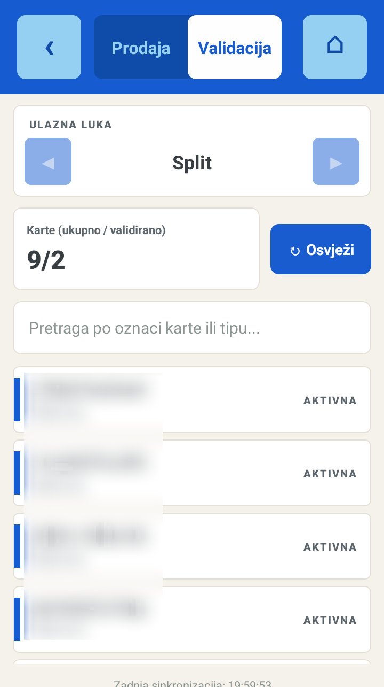

### 6. Zaključak smjene

Na kraju rada idi na **Zaključci smjena**. Pod **Pregled prije zatvaranja** vidiš promet po vrsti plaćanja i ukupno stornirano — provjeri to prije nego zaključiš.

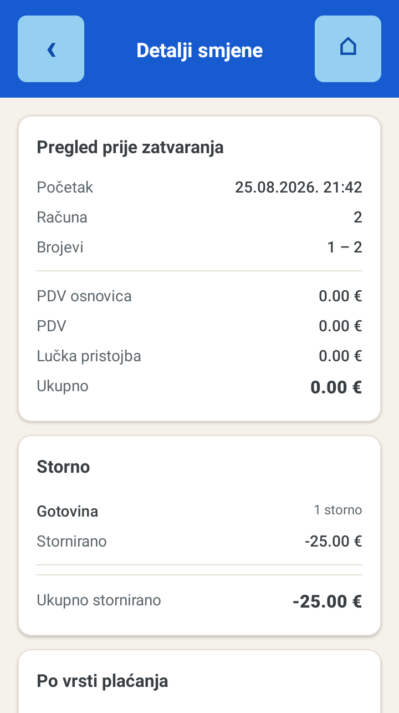

Pritisni **Zaključi smjenu**. Zaključak se ispisuje sam. Kopiju možeš dobiti kasnije: otvori smjenu u popisu **Zadnje smjene** i pritisni **Ispiši**.

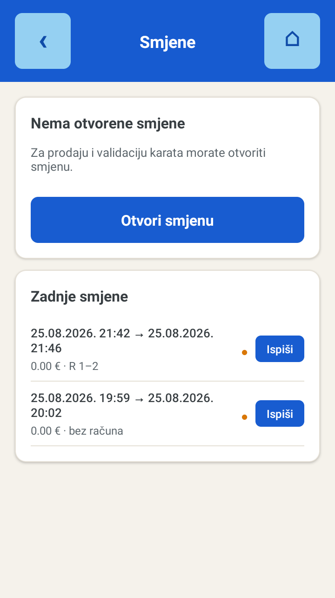

Oznaka **● Čeka sinkronizaciju** uz smjenu znači da zaključak još nije stigao na poslužitelj. Uređaj ga šalje sam čim uhvati mrežu; ništa se ne gubi.

---

## Kad zatreba

### Računi, kopije i storno

Sve izdano nalazi se pod **Dokumenti**. Uz svaki račun stoje oznake koje odmah kažu o čemu se radi:

| Oznaka | Značenje |
| --- | --- |
| **STORNO** | Sam storno dokument — račun kojim je poništen neki raniji. |
| **STORNIRAN** | Izvorni račun koji je storniran. |
| **F2** | Račun je fiskaliziran kao e-račun. |
| **Otočna** | Na računu je barem jedna povlaštena otočna karta. |
| **Sync** | Račun je stigao na poslužitelj. |
| **Pending** | Račun je izdan i spremljen na uređaju, ali još nije poslan. |

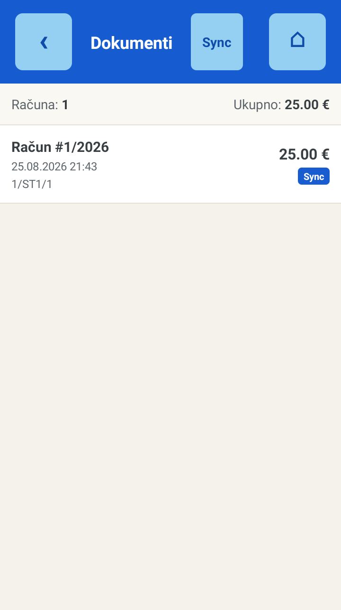

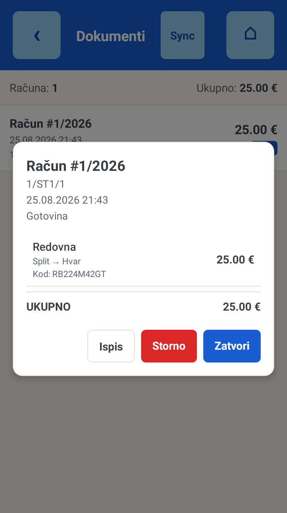

### Kopija računa i karata

Otvori račun u popisu pa pritisni **Ispis**. Ispisuje se račun s oznakom **KOPIJA RAČUNA** i sve karte s oznakom **KOPIJA KARTE**.

Kopija karte nosi i **tri dodatna znaka na kraju broja karte**; isti znakovi idu i u QR kod. Po njima kontrola razlikuje kopiju od karte koju je putnik dobio pri kupnji i vidi koja je po redu. Uređaj ih računa sam, pa kopija izlazi i bez interneta — ispis se zabilježi i pošalje uredu kad veza proradi.

Ako je na naplatnom uređaju postavljen **logotip**, ispisuje se u vrhu računa i karte. Postavlja ga ured u portalu, zasebno za račun i za kartu.

### Storno

Otvori račun, pritisni **Storno**, označi karte, odaberi postotak povrata i način povrata novca, pa **Provedi storno**. Storno račun se ispisuje odmah, s oznakom STORNO preko cijelog retka.

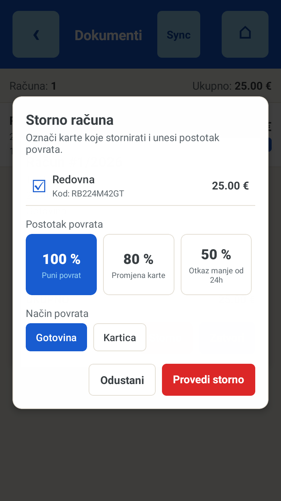

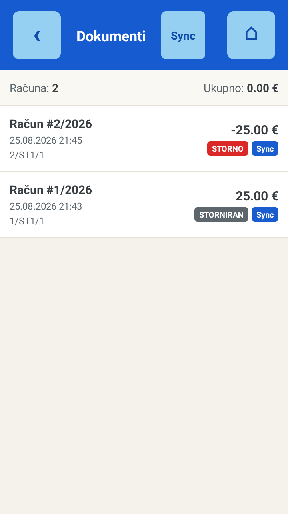

Što se ne može stornirati: storno račun, već stornirani račun i pojedinačna karta koja je već stornirana. Stornirana karta se više ne može ni ispisati.

### Otočna karta

Pritisni **+ Kupi otočnu kartu** i prisloni otočnu iskaznicu na čitač. Uređaj sam očita nositelja, otok i pravo na popust te doda kartu u košaricu.

Poruka „Iskaznica nema pravo na povlašteni prijevoz" znači da iskaznica ne vrijedi za tu relaciju — kartu naplati po redovnoj cijeni.

### Kartično plaćanje

Ako je odabrano sredstvo kartično, terminal prvo pokreće naplatu i tek nakon uspješne transakcije izdaje račun. Zato nikad ne ostaje izdan račun bez naplate.

Ako naplata ne prođe, uređaj javi razlog i vraća te na košaricu. Ništa nije izdano — pokušaj ponovno ili naplati gotovinom.

---

## Rad bez interneta

Terminal je napravljen da radi i bez mreže. Svi podaci — cjenik, plovidbeni red, operateri — stoje na uređaju, a račun se uvijek izda i spremi lokalno. Slanje na poslužitelj je zaseban posao koji uređaj obavlja sam čim mreža bude dostupna.

Prodaja se nastavlja normalno i bez signala. Takvi računi nose oznaku **Pending** dok ne budu poslani.

Ako želiš poslati zaostalo odmah, otvori **Dokumenti** i pritisni gumb za sinkronizaciju u zaglavlju. Uređaj javi koliko je poslano, a koliko je ostalo.

---

## Ako nešto ne radi

| Što vidiš | Što napraviti |
| --- | --- |
| „Nema linija za današnji dan" | Povuci popis prema dolje da se osvježi. Ako i dalje nema, provjeri je li plovidbeni red za danas unesen i je li linija omogućena tvom uređaju. |
| „Nema cjenika za ovu relaciju" | Za odabrani par luka nije unesena cijena. Javi uredu; kartu se ne može prodati dok cjenik ne stigne. |
| „Nema sinkroniziranih načina plaćanja" | Uređaj nema dopuštena sredstva plaćanja. Odjavi se i pritisni **Osvježi podatke**. |
| Novi operater se ne može prijaviti | Na ekranu prijave pritisni **Osvježi podatke** — operateri se povlače s poslužitelja. |
| Izmjena iz portala nije stigla | Uređaj ne povlači promjene sam. Upotrijebi **Osvježi podatke** na prijavi ili povuci popis linija prema dolje. |
| „Podaci nisu osvježeni — nema veze s poslužiteljem" | Uređaj nije došao do poslužitelja. Provjeri mrežu. Radi se sa zadnjim spremljenim podacima, prodaja se ne zaustavlja. |
| Karta se ne skenira | Očisti prozorčić skenera i drži kod na desetak centimetara. Ako ni tada ne ide, potraži kartu ručno preko pretraživanja. |

Kad prijavljuješ problem uredu, reci **TID uređaja i verziju** — oboje piše na dnu ekrana za prijavu, ispod obrasca.

---

Upute vrijede za TraveloAPP Boat Mobile, verzija 1.0.8. Izgled pojedinih ekrana ovisi o postavkama uređaja u portalu — dopuštena sredstva plaćanja, linije i prava operatera postavlja ured.
